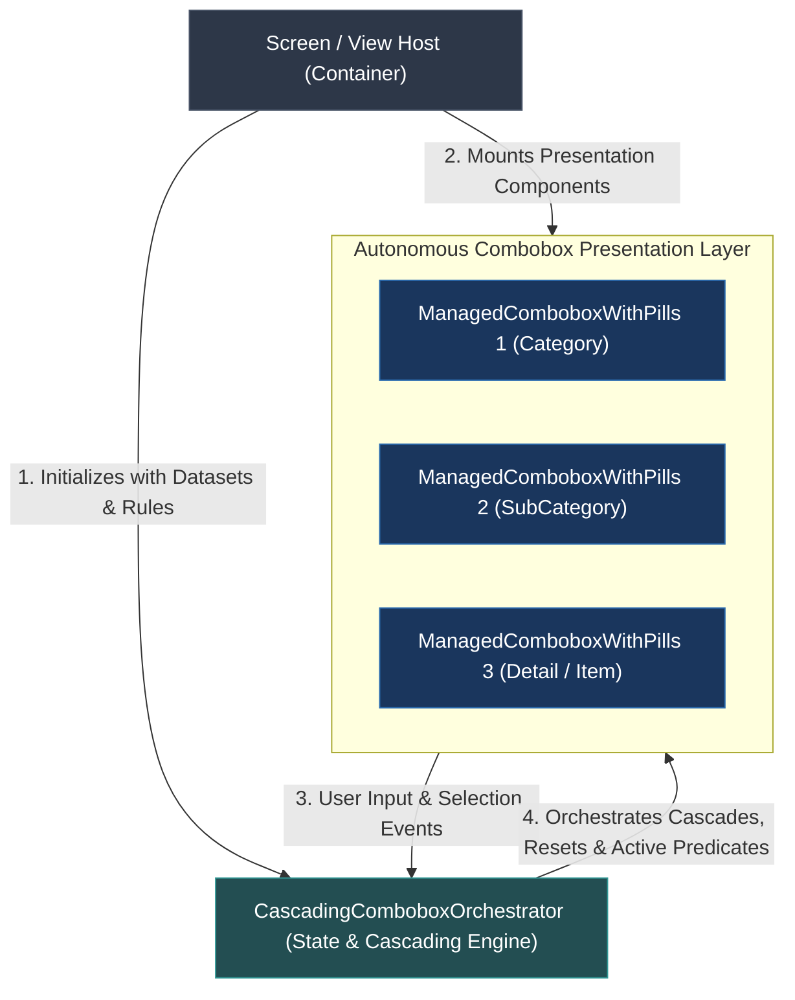
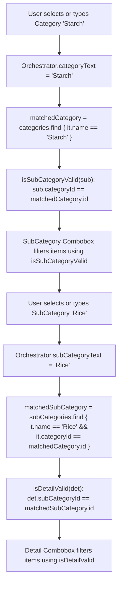

# Architectural Specification: Standalone Cascading Combobox Orchestrator

This document defines the permanent, language-agnostic architectural specification, state machine, and contract for the **Standalone Cascading Combobox Orchestrator Tool**.

---

## 1. Core Architectural Philosophy: Orchestration & Delegation

The Orchestrator is purpose-built to **handle and coordinate the cascading state, dependencies, and updates** across the combobox hierarchy. The Screen hosts the components and delegates the entire cascading logic to the Orchestrator:



### Architectural Division of Responsibility:
1. **The Orchestrator is the Cascading Engine**:
   - Manages hierarchical state (`categoryText`, `subCategoryText`, `detailText`).
   - Handles selection changes and automatically triggers cascade resets (e.g., changing Category clears invalid SubCategory and Detail).
   - Dynamically resolves matched parent entities and evaluates filter predicates for children (`isSubCategoryValid`, `isDetailValid`).
2. **The Combobox is the Generic Presenter**:
   - `ManagedComboboxWithPills<T>` handles rendering, keyboard input, pills grid, search dropdown, and CRUD dialogues.
   - Remains 100% generic (`<T>`) and decoupled from domain rules—it simply consumes `selectedValue`, `filterPredicate`, and emits `onValueChange`.
3. **The Screen is the Host**:
   - Initializes the Orchestrator with domain data.
   - Binds the Orchestrator's properties and predicates to each combobox instance.

---

## 2. Orchestrator Contract & Data Model

### 2.1 Generic Domain Model (`CascadingComboboxOrchestrator<TCat, TSub, TDet>`)

```kotlin
interface CascadingOrchestratorContract<TCat, TSub, TDet> {
    // 1. Raw Datasets
    val categories: List<TCat>
    val subCategories: List<TSub>
    val details: List<TDet>

    // 2. Bound String State
    var categoryText: String
    var subCategoryText: String
    var detailText: String

    // 3. Active Entity Matchers (Computed)
    val matchedCategory: TCat?
    val matchedSubCategory: TSub?
    val matchedDetail: TDet?

    // 4. Filtering Predicates (Passed to Comboboxes)
    fun isSubCategoryValid(sub: TSub): Boolean
    fun isDetailValid(det: TDet): Boolean
}
```

### 2.2 Simplified String Model (`SimpleStringComboboxOrchestrator`)
For lightweight screens where categories and items are already plain strings or mapped via lookup dictionaries:

```kotlin
interface SimpleStringOrchestratorContract {
    val categories: List<String>
    val subCategories: List<String>
    val details: List<String>
    val subCatFilterMap: Map<String, List<String>>
    val detailFilterMap: Map<String, List<String>>

    var categoryText: String
    var subCategoryText: String
    var detailText: String

    fun isSubCategoryValid(sub: String): Boolean
    fun isDetailValid(det: String): Boolean
}
```

---

## 3. Algorithmic State Resolution Logic



### Resolution Algorithms (Pseudocode):

```text
ALGORITHM ResolveMatchedEntities:
INPUT: 
    categories: List<TCat>,
    subCategories: List<TSub>,
    details: List<TDet>,
    catToText: Function(TCat -> String),
    subToText: Function(TSub -> String),
    detToText: Function(TDet -> String),
    subBelongsToCat: Function((TSub, TCat?, String) -> Boolean),
    detBelongsToSub: Function((TDet, TSub?, String, String) -> Boolean)

PROPERTIES:
    matchedCategory:
        FOR EACH cat IN categories:
            IF catToText(cat) EQUALS_IGNORE_CASE categoryText.trim():
                RETURN cat
        RETURN NULL

    matchedSubCategory:
        FOR EACH sub IN subCategories:
            IF subToText(sub) EQUALS_IGNORE_CASE subCategoryText.trim() 
               AND subBelongsToCat(sub, matchedCategory, categoryText):
                RETURN sub
        RETURN NULL

    matchedDetail:
        FOR EACH det IN details:
            IF detToText(det) EQUALS_IGNORE_CASE detailText.trim()
               AND detBelongsToSub(det, matchedSubCategory, subCategoryText, categoryText):
                RETURN det
        RETURN NULL

METHODS:
    FUNCTION isSubCategoryValid(sub: TSub) -> Boolean:
        RETURN subBelongsToCat(sub, matchedCategory, categoryText)
    END FUNCTION

    FUNCTION isDetailValid(det: TDet) -> Boolean:
        RETURN detBelongsToSub(det, matchedSubCategory, subCategoryText, categoryText)
    END FUNCTION
```

---

## 4. End-to-End Screen Integration Pattern

Here is the standardized pattern to orchestrate any screen with 3-tier comboboxes:

```kotlin
@Composable
fun AddEditTransactionsScreen(
    viewModel: AddEditViewModel
) {
    val categories by viewModel.categories.collectAsState()
    val subCategories by viewModel.subCategories.collectAsState()
    val details by viewModel.details.collectAsState()

    // 1. Instantiate the Orchestrator Tool at Screen Level
    val orchestrator = rememberCascadingComboboxOrchestrator(
        categories = categories,
        subCategories = subCategories,
        details = details,
        catToText = { it.name },
        subToText = { it.name },
        detToText = { it.name },
        subBelongsToCat = { sub, matchedCat, catText ->
            if (matchedCat != null) sub.categoryId == matchedCat.id
            else false
        },
        detBelongsToSub = { det, matchedSub, subText, catText ->
            if (matchedSub != null) det.subCategoryId == matchedSub.id
            else false
        },
        initialCategory = initialCategoryName,
        initialSubCategory = initialSubCatName,
        initialDetail = initialDetailName
    )

    // 2. Attach Tier 1: Category (Root)
    ManagedComboboxWithPills(
        label = "Category",
        selectedValue = orchestrator.categoryText,
        onValueChange = { orchestrator.categoryText = it },
        items = orchestrator.categories,
        itemToText = { it.name },
        onAddItem = { showAddCategoryDialog() },
        onEditItem = { cat -> showEditCategoryDialog(cat) },
        onDeleteItem = { cat -> viewModel.deleteCategory(cat) }
    )

    // 3. Attach Tier 2: SubCategory (Child of Category)
    ManagedComboboxWithPills(
        label = "SubCategory",
        selectedValue = orchestrator.subCategoryText,
        onValueChange = { orchestrator.subCategoryText = it },
        items = orchestrator.subCategories,
        parentFilterKey = orchestrator.categoryText, // Auto-cascade invalidation trigger
        filterPredicate = { orchestrator.isSubCategoryValid(it) },
        itemToText = { it.name },
        onAddItem = { showAddSubCategoryDialog(orchestrator.matchedCategory?.id) },
        onEditItem = { sub -> showEditSubCategoryDialog(sub) },
        onDeleteItem = { sub -> viewModel.deleteSubCategory(sub) }
    )

    // 4. Attach Tier 3: Detail (Grandchild of SubCategory)
    ManagedComboboxWithPills(
        label = "Detail",
        selectedValue = orchestrator.detailText,
        onValueChange = { orchestrator.detailText = it },
        items = orchestrator.details,
        parentFilterKey = Pair(orchestrator.categoryText, orchestrator.subCategoryText),
        filterPredicate = { orchestrator.isDetailValid(it) },
        itemToText = { it.name },
        onAddItem = { showAddDetailDialog(orchestrator.matchedSubCategory?.id) },
        onEditItem = { det -> showEditDetailDialog(det) },
        onDeleteItem = { det -> viewModel.deleteDetail(det) }
    )
}
```

---

## 5. Reusability Across Any Other Project

When copying this architecture to a new project:
1. Copy `ManagedComboboxWithPills` (the generic UI primitive).
2. Copy `CascadingComboboxOrchestrator` (the lightweight orchestration tool).
3. The screen simply instantiates the Orchestrator with its domain data model and passes the properties to the Comboboxes.
4. Zero tight coupling, zero circular dependencies, and 100% modular.
