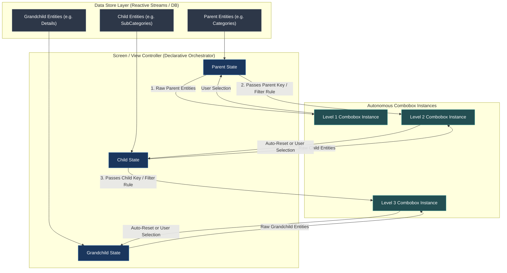
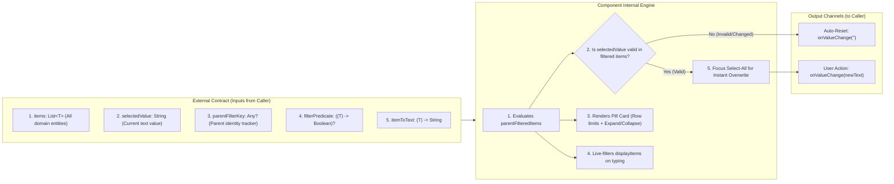
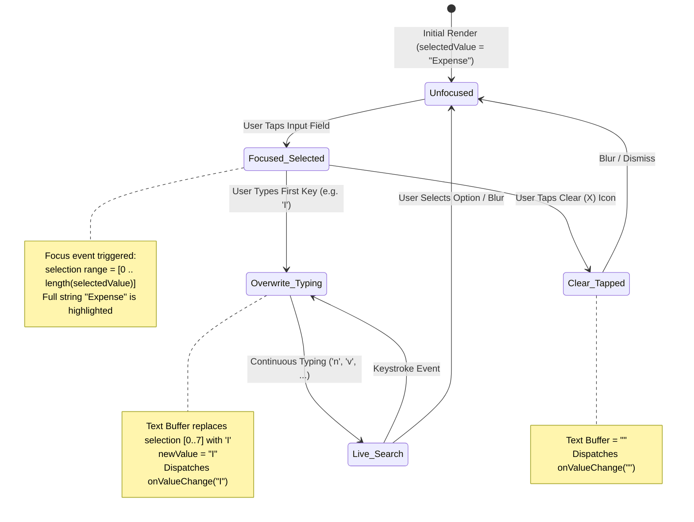
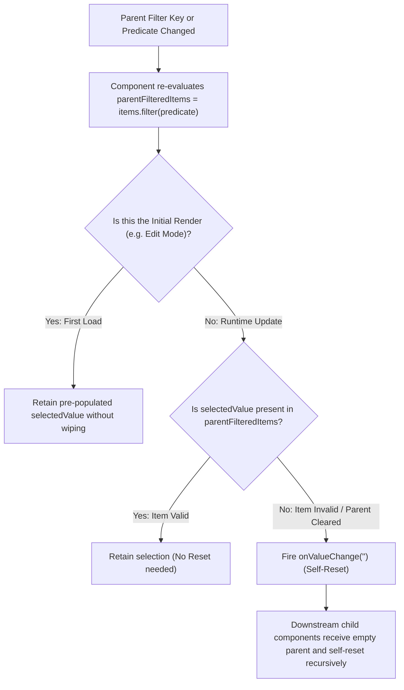

# Permanent Specification: Autonomous Managed Combobox with Pills & Cascading Orchestration

This document serves as the permanent, framework-agnostic architectural specification and algorithmic reference for the **Autonomous Managed Combobox with Pills Component** and its **Hierarchical Cascading Orchestrator**.

---

## 1. High-Level Architectural Model

The component is designed as an **autonomous, self-contained interactive combobox** that encapsulates:
1. **Raw Domain Entity Filtering** via parent predicates.
2. **Autonomous Cascading Invalidation** (self-resetting without external imperative triggers).
3. **Live Search & Dynamic Dropdown Virtualization**.
4. **Intelligent Text Selection & Instant Overwrite on Focus/Typing**.
5. **Configurable Quick-Pick Pill Card** with row limiting, expand/collapse toggles, and persistent settings.
6. **Integrated Inline CRUD Actions** (Add, Edit, Delete).



---

## 2. Component Contract (Inputs, Internals & Outputs)



---

## 3. Formal Data Contract Specification

| Parameter | Type / Signature | Description |
| :--- | :--- | :--- |
| **`items`** | `List<T>` (Generic Collection) | The complete, unfiltered dataset of domain entity objects. |
| **`selectedValue`** | `String` | The current selected string value bound to the component. |
| **`parentFilterKey`** | `Any?` (Nullable Object/Primitive) | The parent entity ID, name, or tuple. Changes signal a parent state update. |
| **`filterPredicate`** | `((T) -> Boolean)?` | Lambda defining membership criteria of item `T` under the active parent. |
| **`autoResetOnParentChange`** | `Boolean` (Default: `true`) | When true, automatically resets `selectedValue` if invalid under new parent. |
| **`itemToText`** | `(T) -> String` | Extractor function mapping entity `T` to human-readable string representation. |
| **`onValueChange`** | `(String) -> Unit` | Primary output stream emitting selected values and auto-resets. |
| **`onAddItem`** | `(() -> Unit)?` | CRUD trigger to open creation dialog for entity `T`. |
| **`onEditItem`** | `((T) -> Unit)?` | CRUD trigger to open editing dialog for an item `T`. |
| **`onDeleteItem`** | `((T) -> Unit)?` | CRUD trigger to delete an item `T`. |

---

## 4. Algorithmic State Machines & Logic

### 4.1 Focus, Text Selection & Instant Overwrite Engine



#### Pseudocode:
```text
FUNCTION onFocusChangeHandler(currentFocus, previousFocus, currentValue):
    IF currentFocus.isFocused == TRUE AND previousFocus.isFocused == FALSE THEN
        IF currentValue IS NOT EMPTY THEN
            SET textSelectionRange = Range(start = 0, end = LENGTH(currentValue))
        END IF
    END IF
END FUNCTION

FUNCTION onTextInputHandler(newInputState, previousSelectedValue):
    IF newInputState.text != previousSelectedValue THEN
        CALL onValueChange(newInputState.text)
    END IF
END FUNCTION
```

---

### 4.2 Autonomous Cascading Invalidation Engine



#### Pseudocode:
```text
ALGORITHM AutonomousComboboxResetEngine:
INPUT: 
    items: List<T>, 
    filterPredicate: Function(T -> Boolean), 
    parentFilterKey: Any, 
    currentSelectedValue: String, 
    isInitialComposition: Boolean

BEGIN
    // Step 1: Internal Filtering
    IF filterPredicate IS NOT NULL THEN
        parentFilteredItems = FILTER items WHERE filterPredicate(item) == TRUE
    ELSE
        parentFilteredItems = items
    END IF

    // Step 2: Invalidation Check
    IF isInitialComposition == TRUE THEN
        SET isInitialComposition = FALSE
        RETURN parentFilteredItems
    END IF

    // Step 3: Self-Triggered Cleanup
    IF currentSelectedValue IS NOT EMPTY THEN
        SET matchFound = FALSE
        FOR EACH item IN parentFilteredItems DO
            IF itemToText(item) EQUALS_IGNORE_CASE currentSelectedValue.trim() THEN
                matchFound = TRUE
                BREAK
            END IF
        END FOR

        IF matchFound == FALSE THEN
            CALL onValueChange("")
        END IF
    END IF

    RETURN parentFilteredItems
END
```

---

## 5. UI Architecture: Expandable Pills Card Layout

The component separates **CRUD item addition** from **Pill overflow display**:
1. **Dedicated Input Row**:
   * Text Input field with non-blocking live filtering and non-focusable dropdown popup.
   * `(+)` CRUD Add Button: strictly for creating a new entity item in the database.
   * `(⚙)` Settings Gear: opens combobox personalization dialog (row count limit, alphabetical/creation sort, visible item count, scroll step speed).
2. **Dedicated Quick-Pick Pills Card**:
   * Card Header: `"Quick Pick [count]"` with an Expand/Collapse toggle (`▲` / `▼`).
   * Default View: Strictly limits visible items to the configured row count (1 or 2 rows).
   * Expanded View: Shows full multi-row wrap of all items.
   * Each Pill Chip includes inline Edit `(✎)` and Delete `(✕)` action icons on long-press or settings toggle.

---

## 6. How to Use the Component: End-to-End Screen Integration

Here is the exact pattern for wiring a 3-tier cascading hierarchy (`Category` → `SubCategory` → `Detail`) in any screen:

```kotlin
// In your Screen Composable / View Controller:

// 1. Collect your domain lists (e.g. from Database or Repository)
val categories by viewModel.categories.collectAsState()           // List<CategoryEntity>
val subCategories by viewModel.subCategories.collectAsState()     // List<SubCategoryEntity>
val details by viewModel.details.collectAsState()                 // List<DetailEntity>

var categoryText by remember { mutableStateOf(currentCategoryName) }
var subCategoryText by remember { mutableStateOf(currentSubCatName) }
var detailText by remember { mutableStateOf(currentDetailName) }

val matchedCategory = categories.find { it.name.equals(categoryText.trim(), ignoreCase = true) }
val matchedSubCat = subCategories.find { 
    it.name.equals(subCategoryText.trim(), ignoreCase = true) && 
    (matchedCategory == null || it.categoryId == matchedCategory.id)
}

// -------------------------------------------------------------
// LEVEL 1: Category Combobox (Independent Root)
// -------------------------------------------------------------
ManagedComboboxWithPills(
    label = "Category",
    selectedValue = categoryText,
    onValueChange = { input -> 
        categoryText = input
        val matched = categories.find { it.name.equals(input.trim(), ignoreCase = true) }
        if (matched != null) viewModel.updateCategoryId(matched.id)
    },
    items = categories,
    itemToText = { it.name },
    onAddItem = { openAddCategoryDialog() },
    onEditItem = { cat -> openEditCategoryDialog(cat) },
    onDeleteItem = { cat -> viewModel.deleteCategory(cat) }
)

// -------------------------------------------------------------
// LEVEL 2: SubCategory Combobox (Child of Category)
// -------------------------------------------------------------
ManagedComboboxWithPills(
    label = "SubCategory",
    selectedValue = subCategoryText,
    onValueChange = { subCategoryText = it },
    items = subCategories,
    parentFilterKey = categoryText,                              // <-- Signals Category change
    filterPredicate = { subCat ->                                // <-- Filter rule
        if (matchedCategory == null) false
        else subCat.categoryId == matchedCategory.id
    },
    itemToText = { it.name },
    onAddItem = { openAddSubCategoryDialog(matchedCategory?.id) },
    onEditItem = { subCat -> openEditSubCategoryDialog(subCat) },
    onDeleteItem = { subCat -> viewModel.deleteSubCategory(subCat) }
)

// -------------------------------------------------------------
// LEVEL 3: Detail Combobox (Grandchild of SubCategory)
// -------------------------------------------------------------
ManagedComboboxWithPills(
    label = "Detail",
    selectedValue = detailText,
    onValueChange = { detailText = it },
    items = details,
    parentFilterKey = Pair(categoryText, subCategoryText),       // <-- Signals Parent/Grandparent change
    filterPredicate = { detail ->                                // <-- Filter rule
        if (matchedSubCat == null) false
        else detail.subCategoryId == matchedSubCat.id
    },
    itemToText = { it.name },
    onAddItem = { openAddDetailDialog(matchedSubCat?.id) },
    onEditItem = { detail -> openEditDetailDialog(detail) },
    onDeleteItem = { detail -> viewModel.deleteDetail(detail) }
)
```

---

## 7. Key Integration Rules for Developers
1. **Pass the RAW collection**: Always pass the complete dataset (`items = allEntities`) from the database. Let the component filter internally.
2. **Pass the `parentFilterKey`**: Pass the parent's string or ID as `parentFilterKey`. When this value changes, the component automatically re-evaluates the predicate and clears its value if no longer valid.
3. **No manual reset boilerplate**: Do NOT write `subCategoryText = ""` or `detailText = ""` inside the Category's `onValueChange` callback. The child components handle their own cleanup automatically.

