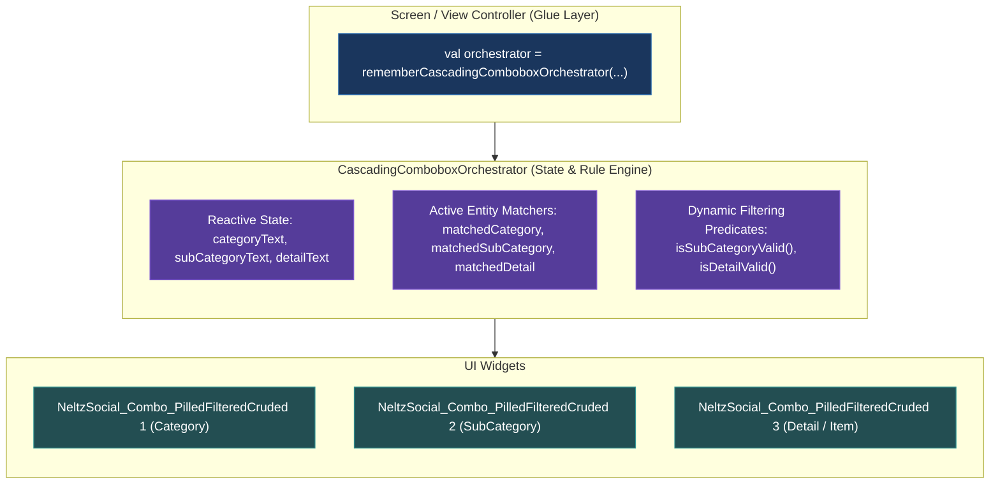

# Permanent Specification: Cascading Combobox Orchestrator Tool

This document specifies the architecture, data contracts, and implementation blueprints for the **`CascadingComboboxOrchestrator`** tool.

---

## 1. Overview & Separation of Concerns



### Architectural Principles:
1. **Zero UI Dependency**: The `CascadingComboboxOrchestrator` contains NO UI imports. It is a pure algorithmic state machine and predicate evaluator.
2. **Dumb, Reusable UI Widgets**: `NeltzSocial_Combo_PilledFilteredCruded<T>` handles rendering, keyboard input, pills grid, search dropdown, and CRUD dialogues.
3. **Screen as Declarative Glue**: The screen instantiates the Orchestrator and binds properties directly to the Combobox components.

---

## 2. Generic Orchestrator Contract & Types

```kotlin
interface CascadingOrchestratorContract<TCat, TSub, TDet> {
    // 1. Reactive Input String States
    var categoryText: String
    var subCategoryText: String
    var detailText: String

    // 2. Active Matched Domain Entities
    val matchedCategory: TCat?
    val matchedSubCategory: TSub?
    val matchedDetail: TDet?

    // 3. Dynamic Filter Predicates
    fun isSubCategoryValid(sub: TSub): Boolean
    fun isDetailValid(det: TDet): Boolean

    // 4. Utility State Checkers
    val isCategoryUnmatched: Boolean
    val isSubCategoryUnmatched: Boolean

    // 5. Bulk Population / Reset
    fun setAll(category: String, subCategory: String, detail: String)
    fun clearAll()
}
```

---

## 3. Implementation Example in Screen

```kotlin
@Composable
fun TransactionForm(
    categories: List<CategoryEntity>,
    subCategories: List<SubCategoryEntity>,
    details: List<DetailEntity>
) {
    val orchestrator = rememberCascadingComboboxOrchestrator(
        categories = categories,
        subCategories = subCategories,
        details = details,
        catToText = { it.name },
        subToText = { it.name },
        detToText = { it.name },
        subBelongsToCat = { sub, cat, _ -> sub.categoryId == cat?.id },
        detBelongsToSub = { det, sub, _, _ -> det.subCategoryId == sub?.id }
    )

    // Category Combobox
    NeltzSocial_Combo_PilledFilteredCruded(
        label = "Category",
        selectedValue = orchestrator.categoryText,
        onValueChange = { orchestrator.categoryText = it },
        items = categories,
        itemToText = { it.name }
    )

    // SubCategory Combobox
    NeltzSocial_Combo_PilledFilteredCruded(
        label = "SubCategory",
        selectedValue = orchestrator.subCategoryText,
        onValueChange = { orchestrator.subCategoryText = it },
        items = subCategories,
        parentFilterKey = orchestrator.categoryText,
        filterPredicate = { orchestrator.isSubCategoryValid(it) },
        itemToText = { it.name }
    )

    // Detail Combobox
    NeltzSocial_Combo_PilledFilteredCruded(
        label = "Detail",
        selectedValue = orchestrator.detailText,
        onValueChange = { orchestrator.detailText = it },
        items = details,
        parentFilterKey = Pair(orchestrator.categoryText, orchestrator.subCategoryText),
        filterPredicate = { orchestrator.isDetailValid(it) },
        itemToText = { it.name }
    )
}
```
