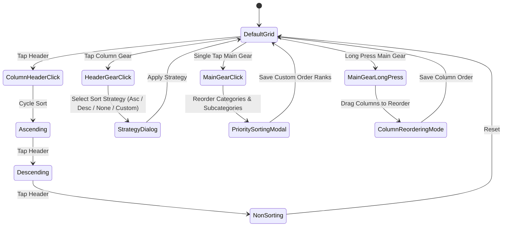

# Architecture Specification: SocialNeltz_Grid_Sortable_Pilled

## 1. Overview & Purpose
`SocialNeltz_Grid_Sortable_Pilled<T>` is a reusable, enterprise-grade, generic data table component designed for rich interactive data presentation, agile multi-column sorting, column reordering, quick-pick pill filtering, and user-defined priority sorting.

---

## 2. Key Architecture Pillars

### A. Dynamic Pill Container with Integrated Gear Action
- **Top Pill Bar**: Horizontally scrolling quick-pick pills dynamically populated based on the active dataset or active column filter.
- **Top Gear Trigger (⚙️)**:
  - **Single Click**: Opens the **Editable Priority Sorting Popup Tab** to configure manual hierarchy orders.
  - **Click & Hold (Long-Press)**: Activates **Column Drag-and-Drop Reordering Mode**, allowing users to visually reposition table columns.

### B. Multi-Strategy Column Header Sorting
- Each sortable column header includes an interactive indicator and a dedicated mini-gear / sort trigger with four distinct strategies:
  1. **Ascending (`ASC`)**: Standard alphanumeric or numeric ascending order.
  2. **Descending (`DESC`)**: Standard alphanumeric or numeric descending order.
  3. **Non-Sorting (`NONE`)**: Natural dataset order without column sorting overhead.
  4. **Custom Priority (`CUSTOM_PRIORITY`)**: Orders items by user-defined position ranks established in the Priority Sorting Tab.

### C. Editable Priority Sorting Popup Tab
- A dedicated modal dialog providing a reorderable list of distinct values (e.g., Categories, Subcategories, or Details).
- Supports drag handles / up-down repositioning to establish hard-coded rank priorities (`Priority 1`, `Priority 2`, ...).
- Priority orders persist and immediately govern column sorting whenever `CUSTOM_PRIORITY` strategy is engaged.

### D. Visual Date Column Omission with Preserved Data Integrity
- The Date column is omitted from the grid table body visually (since global PayDate pills and filters handle the temporal context), avoiding horizontal clutter.
- Date data remains preserved in the underlying row model (`T`) for date-based grouping, calculations, and exports.

---

## 3. Data Models & Component State

```kotlin
enum class ColumnSortStrategy {
    ASCENDING,
    DESCENDING,
    NON_SORTING,
    CUSTOM_PRIORITY
}

data class GridColumnConfig<T>(
    val key: String,
    val headerTitle: String,
    val widthFraction: Float = 1f,
    val isSortable: Boolean = true,
    val defaultSortStrategy: ColumnSortStrategy = ColumnSortStrategy.NON_SORTING,
    val valueExtractor: (T) -> String,
    val numericExtractor: ((T) -> Double)? = null,
    val cellContent: @Composable (item: T) -> Unit
)

data class GridPriorityRank(
    val itemValue: String,
    val rank: Int
)
```

---

## 4. Interaction Flow & State Machine



---

## 5. Generic Extensibility
The component accepts generic row items `T` and can be utilized across transactions, grocery budgets, investment tables, inventory rosters, and financial audit reports.
